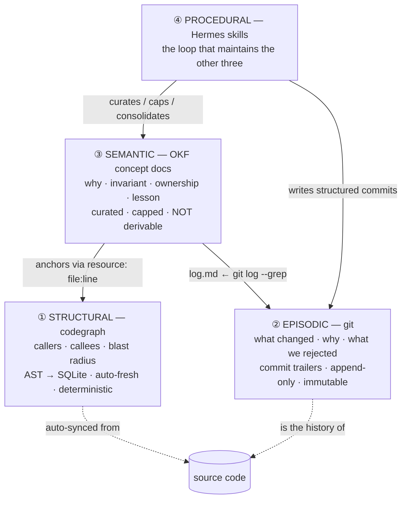
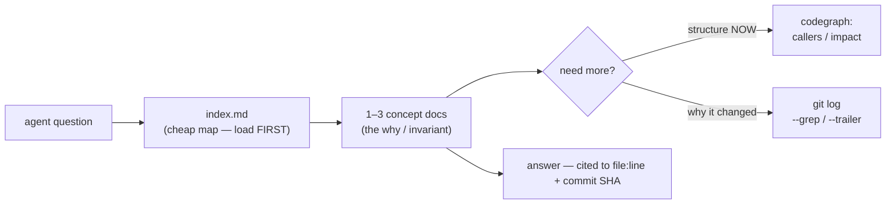
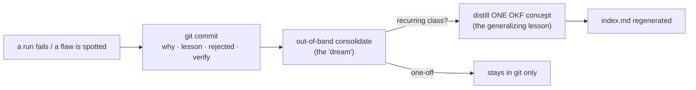

# DESIGN — the four-layer knowledge architecture

This is the *why*. The [README](README.md) is the *what*. Everything here traces to either a property we can demonstrate or a finding from a multi-source review of how coding agents actually remember things (Anthropic's own Claude Code memory internals, the "git-as-memory" practitioners, and the agent-memory literature). Where a claim is practitioner-experience rather than benchmarked, it says so.

---

## 1. The problem: rot, not scarcity

The instinct when an agent forgets is to *add a store* — a vector DB, a memory service. But the measured failure mode is the opposite of scarcity:

- Accuracy degrades from ~90% to ~51% as a conversation grows; many models fall below 50% past ~32K tokens of loaded context ("context rot").
- More retrieved context regularly makes output *worse*, not better. Even one irrelevant element can lower performance.
- In Anthropic's own Claude Code telemetry, ~97% of memory-relevance lookups return nothing — retrieval is mostly noise that must be kept *off* the hot path.

So the design goal is not "remember more." It is **the right knowledge at the right altitude, and nothing else in the window.** That forces a separation of concerns: different kinds of knowledge have different lifespans, write authorities, and freshness needs, and collapsing them into one fat file is the thing that rots.

---

## 2. The four layers and their roles

The whole architecture is one rule applied four times: **each layer is the single source of truth for exactly one kind of knowledge, and the others reference it instead of copying it.**



Read it top-down: the **semantic** layer is the apex you actually read; it points *down* into structure and history rather than restating them; the **procedural** loop keeps the apex small and true.

### Layer ① Structural — codegraph: *the map of what IS*

**Role.** Hand the agent the code's *resolved* structure so it never greps-and-guesses: every caller of a function (including callbacks the parser would miss), the blast radius of a change, who imports what, which class extends which. It is **wide, shallow, mechanical, and always fresh** — a node per symbol, an edge per relationship, rebuilt from the AST on file change.

**The ceiling (important).** It stores *only* what the AST contains. It can tell you `authenticate` has a 300-symbol blast radius; it can **never** tell you *why* auth is built this way, what invariant must hold, or which module is the source of truth. That gap is exactly Layer ③'s job.

**Why it's genuinely innovative.** Three things at once that prior tools didn't combine:
1. **Deterministic, not generative.** Derived from real ASTs, *never* LLM-summarized — so it cannot hallucinate a call edge. No embeddings, no second model, no API key.
2. **Transitive answers in one call.** "Every caller of X, N hops of impact, across dynamic dispatch and framework routing" is precomputed and returned in a single query — collapsing what is otherwise a slow, lossy, non-deterministic grep-and-reason loop. In practice this measured ~47% fewer tokens and ~58% fewer tool calls on real tasks.
3. **Local and committable.** It is just a SQLite file; nothing leaves the machine.

The insight: **compiler-grade structure, exposed as a queryable memory.** An LSP gives an editor this interactively; codegraph gives an *agent* the transitive, language-agnostic, blast-radius form.

### Layer ② Episodic — git: *the log of what CHANGED and why*

**Role.** The grounded, append-only, attributed record of every decision — and crucially, **what was tried and rejected.** This is the root layer: when the semantic layer and reality disagree, git is the tiebreaker.

**Why git-as-memory is the quiet breakthrough.** Every repository already contains an immutable, time-ordered, attributed event log. The innovation is not new infrastructure — it's recognizing that the **VCS is already the episodic memory** and putting a small *grammar* on top so an agent can read and write it:

```
skillsys(<scope>): <one-line imperative rule>

why:      <the run/finding/date that triggered it>
lesson:   <symptom → root cause → the GENERAL rule>
rejected: <what we tried that did NOT work>     # the "anti-hallucination field"
verify:   <what the next run should confirm>
```

queried with `git log --grep`, `git log --trailer=`, `git log -S '<symbol>'`, `git log -L`. The payoffs:

- **Zero new infrastructure.** No service to run, no store to sync; the memory *is* the history, with free attribution and time-ordering.
- **The `rejected:` field stops loops.** Before re-proposing a fix, the agent reads what already failed — the single highest-value anti-hallucination move in the whole system.
- **It's bi-temporal for free.** You can ask "what was true at commit X," and supersede cleanly instead of overwriting.

The discipline that makes it work: **store the lesson, not the instance** ("facts decay; reasoning compounds"), and never duplicate the log into a file (§5).

### Layer ③ Semantic — OKF concepts: *the meaning that can't be derived*

**Role.** Hold what is **not** in the AST or a diff: the *why*, the *invariant*, the *ownership* ("this module is the source of truth for X"), the gotcha, the distilled lesson. This is the layer you read to get the **highest-level understanding for the lowest effort** — a handful of `type`-tagged markdown concepts instead of tens of thousands of lines.

It is the **inverse of codegraph**: narrow, deep, curated, slow-changing, capped — and it **anchors down** (`resource: file:line`, links to commits) rather than restating structure or history.

**Why OKF, honestly.** OKF is "a directory of markdown files with YAML frontmatter; the only required field is `type`," plus a reserved `index.md` (progressive disclosure) and `log.md` (history). Its real contribution is a *conformance contract*, not a data model — it standardizes **structural** interoperability, not shared semantics. We use it because the artifact is then **portable, diffable, human- and agent-readable, and vendor-neutral** — and because adopting it is nearly free if your knowledge is already markdown. We are not betting the architecture on OKF winning; we adopt it for optionality.

| | codegraph (①) | OKF concepts (③) |
|---|---|---|
| breadth × depth | wide, shallow (every symbol) | narrow, deep (key subsystems) |
| content | mechanical structure | why · invariant · ownership · lesson |
| volume | thousands of nodes | tens of concepts (capped) |
| freshness | auto-fresh | curated, slow |
| relation | the layer ③ **points down to** | the meaning ① **can't produce** |

### Layer ④ Procedural — the maintaining loop (Hermes)

**Role.** The governance that keeps the other three small and true: **capture → route → edit → verify → approve → commit**, human-gated, with the rule *generalize or don't ship* (a fix that only helps the case in front of you is a bug, not a lesson), and **out-of-band consolidation** (the "dream") that distills recurring failures and prunes stale knowledge.

**Why this layer is non-optional — and the strongest research finding here.** Autonomy *without* curation measurably degrades a self-maintaining knowledge base: in one study, fully LLM-authored skills contributed **+0.0pp** versus **+16.2pp** for human-curated ones; the governance that recovers the gain is a **hard cap + retirement-by-contribution + a meta-skill** (removing the meta-skill alone cost 43% of the gain). Two more load-bearing findings:

- **Reflect on failures, not successes.** Forcing reflection on wins induces reward-hacking and destroys generalization — so the loop captures on *flaws*.
- **Consolidate out-of-band, never on the hot path.** A background pass that rewrites memory from recent transcripts cut first-pass mistakes ~90% in one report, *and* keeps the cost off the agent's critical path.

This is the lineage of the **Hermes** stewardship method (the "human is the eye," every edit must generalize, the iteration log is git). The point: a maintaining loop is the *mechanism*, not polish.

---

## 3. How the layers compose — the rules that prevent rot



**The read path is index-first, just-in-time.** Read the index (titles + one-line descriptions), pull the 1–3 concepts that match, then drop to codegraph or git only if you still need structure or history. *Never load the whole tree* — that is the context-rot failure mode dressed up as diligence.



**The write path turns events into durable meaning.** A flaw becomes a structured commit (episodic). The consolidation pass distills only the *recurring* classes into a concept doc (semantic); one-offs stay in git alone. The index is regenerated, never hand-edited.

The two rules that hold it all together:

- **Single source of truth per altitude; link, never copy.** Structure lives in codegraph; history in git; meaning in OKF. A concept `resource:`-anchors a symbol and `--grep`-points at commits; it does not restate them. This is the anti-duplication discipline, and it is what keeps the readable layer small.
- **Generated views are generated, never authored.** `log.md ← git`, `index.md ← a scan of the concepts`. A hand-maintained log or index is a second copy that drifts; here they're build artifacts you can regenerate on every commit.

---

## 4. Design guidelines (the distilled, realistic rules)

These are the knobs the research actually moved:

1. **One fact = one file.** Small, single-purpose concepts; easy to supersede, cite, and prune.
2. **Cap the index.** Keep the index small (≈200 lines / 25 KB is a known good ceiling; past it the bottom silently truncates). The index is the attention budget.
3. **Store the lesson, not the instance.** "Use X here" is useful once; "*why* X, and how to recognize the situation" generalizes. Facts decay; reasoning compounds.
4. **The exclusion list (the rot-killer).** Never write into a standing doc anything that is (a) recoverable from `git log`/`git blame`, (b) in-progress task state, (c) a one-off instead of a rule, or (d) deducible from the code in ~5 seconds. *Most memory bloat is an exclusion-list violation, not a length problem.*
5. **Reflect on failures, not successes** (success-reflection rewards-hacks).
6. **Consolidate out-of-band, on demand** — never on the hot path, never on a fixed timer; when it feels messy or the index drifts.
7. **Keep a human in the loop, with a cap.** Autonomy without curation degrades; a cap + retirement + a meta-skill is the floor, not bureaucracy.
8. **Freshness is explicit.** A concept is a point-in-time observation; check `timestamp` and the code before trusting an old note. Generated views (codegraph, log.md, index.md) carry their own freshness.
9. **Progressive disclosure everywhere.** Load names/descriptions first, bodies on demand, scripts last.

---

## 5. What this is *not* (so you can trust the parts that are real)

- **Not a database or vector store.** It is files + git + an optional code index, plus conventions. If you need fuzzy semantic recall over huge corpora, that's a different tool; this is for *curated, traceable* knowledge.
- **Not a bet that OKF wins.** OKF v0.1 is young and, by its own framing, advances structural — not semantic — interoperability; it launched with little outside adoption. We adopt it because it's cheap, portable, and reversible, and because our knowledge was already markdown. If it stalls, we've lost nothing; if it spreads, we already speak it.
- **Not universally worth every layer.** Codegraph earns its keep on larger, multi-language, cross-coupled codebases and adds little to prose-heavy or tiny single-file projects. The semantic + episodic layers are the portable core; the structural layer is opt-in by repo.
- **Not autonomous.** The whole point of Layer ④ is that a human is the quality eye and a cap bounds growth — because the alternative measurably rots.

The honest summary: most of this is *recognizing that you already have the layers* (git is your episodic memory; your markdown is a semantic bundle; your code has a structure) and giving them a thin, shared, portable shape plus the curation discipline that keeps them from rotting. The advantage is **legibility and low effort at the top, determinism and zero-infra at the bottom, and no duplication in between.**

---

_Provenance: design grounded in a multi-source research pass on coding-agent memory (Claude Code memory internals, the git-as-memory practitioners, the agent-memory literature). Actively dogfooded on a real skill-system codebase to test effectiveness; findings will sharpen these guidelines as evidence accrues._
